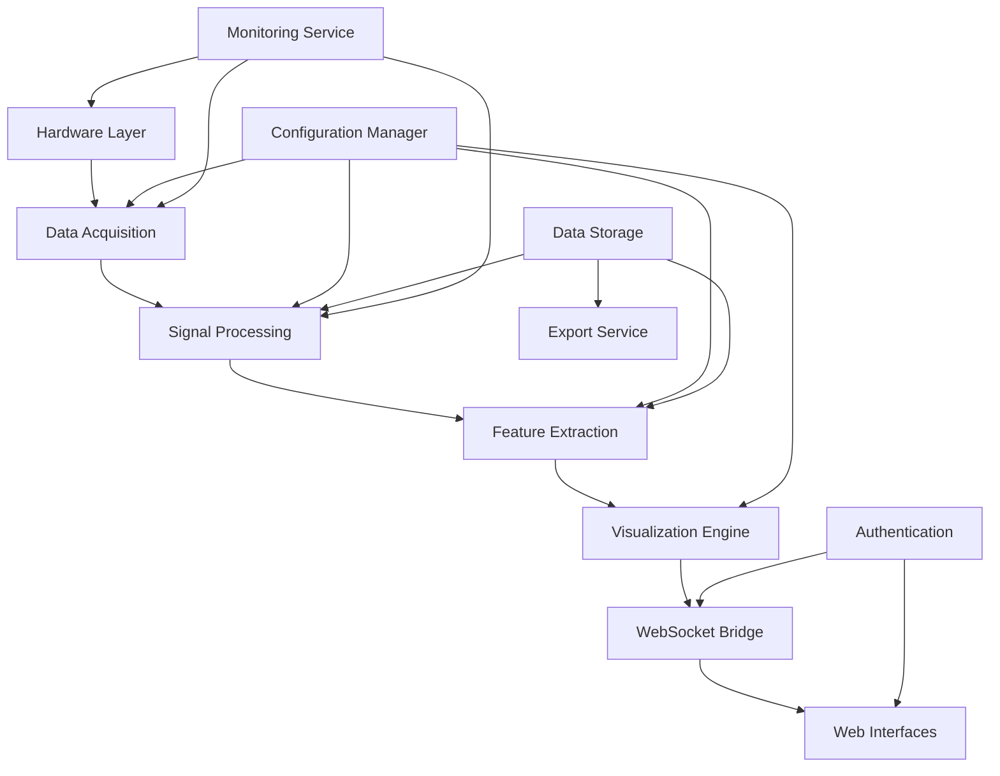

# System Design Document

## Table of Contents
- [Architecture Overview](#architecture-overview)
- [System Components](#system-components)
- [Data Flow Architecture](#data-flow-architecture)
- [Technology Stack](#technology-stack)
- [Design Patterns](#design-patterns)
- [Scalability Considerations](#scalability-considerations)
- [Security Design](#security-design)

## Architecture Overview

Brain-Forge implements a **layered, microservices-oriented architecture** designed for real-time brain data processing and visualization. The system is built with modularity, scalability, and maintainability as core principles.

### High-Level Architecture

```
┌─────────────────────────────────────────────────────────────┐
│                    Presentation Layer                       │
├─────────────────────┬───────────────────┬───────────────────┤
│  Streamlit Dashboard│   React Demo GUI  │  Clinical Interface│
│  (Scientific)       │  (Demonstration)  │  (Future)         │
└─────────────────────┴───────────────────┴───────────────────┘
┌─────────────────────────────────────────────────────────────┐
│                     API Gateway Layer                      │
├─────────────────────┬───────────────────┬───────────────────┤
│   WebSocket Bridge  │    REST API       │   GraphQL API     │
│   (Real-time)       │   (Standard)      │   (Future)        │
└─────────────────────┴───────────────────┴───────────────────┘
┌─────────────────────────────────────────────────────────────┐
│                  Business Logic Layer                      │
├─────────────────────┬───────────────────┬───────────────────┤
│ Signal Processing   │   Visualization   │  Data Management  │
│ Pipeline            │   Engine          │  Service          │
└─────────────────────┴───────────────────┴───────────────────┘
┌─────────────────────────────────────────────────────────────┐
│                 Hardware Integration Layer                 │
├─────────────────────┬───────────────────┬───────────────────┤
│    OPM Helmet       │  Kernel Optical   │  Accelerometer    │
│    Controller       │  Interface        │  Arrays           │
└─────────────────────┴───────────────────┴───────────────────┘
```

### Design Principles

1. **Separation of Concerns**: Each layer has a distinct responsibility
2. **Dependency Inversion**: High-level modules don't depend on low-level modules
3. **Interface Segregation**: Clients depend only on interfaces they use
4. **Single Responsibility**: Each class/module has one reason to change
5. **Open/Closed Principle**: Open for extension, closed for modification

## System Components

### Core Processing Pipeline

```python
┌─────────────────────────────────────────────────────────────┐
│                  Data Acquisition Layer                    │
├─────────────────────┬───────────────────┬───────────────────┤
│  OPMDataAcquisition │ NIRSDataCapture   │ AccelDataStream   │
│  • 306 channels     │ • Dual wavelength │ • 3-axis motion   │
│  • 1-6 kHz sampling │ • Hemodynamic     │ • Artifact detect │
│  • Real-time buffer │   modeling        │ • Motion correct  │
└─────────────────────┴───────────────────┴───────────────────┘
                                │
                                ▼
┌─────────────────────────────────────────────────────────────┐
│                Signal Processing Pipeline                  │
├─────────────────────┬───────────────────┬───────────────────┤
│   Pre-processing    │   Feature Extract │  Pattern Analysis │
│ • Filtering         │ • Spectral power  │ • Connectivity    │
│ • Artifact removal  │ • Time-frequency  │ • Classification  │
│ • Synchronization   │ • Source localize │ • Event detection │
└─────────────────────┴───────────────────┴───────────────────┘
                                │
                                ▼
┌─────────────────────────────────────────────────────────────┐
│                 Visualization Engine                       │
├─────────────────────┬───────────────────┬───────────────────┤
│  3D Brain Rendering │   Activity Overlay│  Network Display  │
│ • PyVista backend   │ • Real-time update│ • Graph algorithms│
│ • Interactive mesh  │ • Color mapping   │ • Dynamic layout  │
│ • Multi-view support│ • Threshold controls • Edge bundling │
└─────────────────────┴───────────────────┴───────────────────┘
```

### Component Interaction Diagram



## Data Flow Architecture

### Real-time Data Pipeline

```
Hardware Devices
       │
       ▼ (USB/Ethernet)
┌─────────────────┐    ┌─────────────────┐    ┌─────────────────┐
│ Data Acquisition│───▶│ Ring Buffer     │───▶│ Signal Processor│
│ Threads         │    │ (Lock-free)     │    │ Pool            │
└─────────────────┘    └─────────────────┘    └─────────────────┘
                                                       │
                                                       ▼
┌─────────────────┐    ┌─────────────────┐    ┌─────────────────┐
│ Visualization   │◀───│ Event Bus       │◀───│ Feature         │
│ Update Queue    │    │ (Observer)      │    │ Extraction      │
└─────────────────┘    └─────────────────┘    └─────────────────┘
       │
       ▼ (WebSocket)
┌─────────────────┐    ┌─────────────────┐
│ WebSocket       │───▶│ Web Clients     │
│ Bridge          │    │ (React/Streamlit│
└─────────────────┘    └─────────────────┘
```

### Data Storage Strategy

```python
# Hierarchical Data Organization
brain_forge_data/
├── sessions/
│   ├── {session_id}/
│   │   ├── raw_data/
│   │   │   ├── opm_data.h5         # Raw magnetometer data
│   │   │   ├── nirs_data.h5        # Optical data
│   │   │   └── accel_data.h5       # Motion data
│   │   ├── processed/
│   │   │   ├── filtered_data.h5    # Preprocessed signals
│   │   │   ├── features.h5         # Extracted features
│   │   │   └── connectivity.h5     # Network analysis
│   │   ├── visualizations/
│   │   │   ├── brain_renders/      # 3D visualizations
│   │   │   └── activity_maps/      # Activity overlays
│   │   └── metadata.json           # Session information
├── configurations/
│   ├── hardware_configs/           # Device settings
│   ├── processing_pipelines/       # Analysis configs
│   └── visualization_themes/       # Display settings
└── exports/
    ├── bids_format/               # BIDS-compliant exports
    ├── matlab_compatible/         # .mat files
    └── analysis_ready/            # MNE-Python format
```

## Technology Stack

### Backend Technologies

```yaml
Core Framework:
  - Python 3.9+: Core application development
  - FastAPI: REST API framework
  - WebSockets: Real-time communication
  - Streamlit: Scientific dashboard framework

Signal Processing:
  - NumPy: Numerical computations
  - SciPy: Scientific algorithms
  - MNE-Python: Neurophysiology analysis
  - Scikit-learn: Machine learning

Visualization:
  - PyVista: 3D scientific visualization
  - Matplotlib: 2D plotting and analysis
  - Plotly: Interactive web visualizations
  - VTK: Advanced 3D graphics

Data Management:
  - HDF5: Hierarchical data storage
  - Pandas: Data manipulation
  - XArray: Multi-dimensional arrays
  - SQLite: Metadata and configuration

Hardware Integration:
  - PySerial: Serial communication
  - libusb: USB device control
  - ZeroMQ: High-performance messaging
  - asyncio: Asynchronous I/O
```

### Frontend Technologies

```yaml
React Demo GUI:
  - React 18: Component-based UI framework
  - TypeScript: Type-safe JavaScript
  - Three.js: 3D graphics and WebGL
  - Tailwind CSS: Utility-first styling
  - Vite: Fast build tool and dev server

Streamlit Dashboard:
  - Streamlit: Python-based web apps
  - Plotly: Interactive plotting
  - Bootstrap: Responsive design
  - Custom CSS: Scientific styling

Development Tools:
  - Webpack: Module bundling
  - ESLint: Code quality
  - Prettier: Code formatting
  - Jest: Testing framework
```

## Design Patterns

### Observer Pattern - Event System

```python
class EventBus:
    """Central event dispatcher for system-wide communication"""

    def __init__(self):
        self._subscribers: Dict[str, List[Callable]] = defaultdict(list)
        self._event_queue = asyncio.Queue()

    def subscribe(self, event_type: str, callback: Callable):
        """Subscribe to specific event types"""
        self._subscribers[event_type].append(callback)

    async def publish(self, event: Event):
        """Publish event to all subscribers"""
        for callback in self._subscribers[event.type]:
            await self._safe_callback(callback, event)

    async def _safe_callback(self, callback: Callable, event: Event):
        """Execute callback with error handling"""
        try:
            if asyncio.iscoroutinefunction(callback):
                await callback(event)
            else:
                callback(event)
        except Exception as e:
            logger.error(f"Event callback failed: {e}")

# Usage Example
event_bus = EventBus()

# Data acquisition publishes new data
event_bus.subscribe("data_acquired", signal_processor.process_new_data)
event_bus.subscribe("data_acquired", visualization_engine.update_display)
event_bus.subscribe("data_acquired", data_manager.store_data)
```

### Factory Pattern - Hardware Abstraction

```python
class HardwareDeviceFactory:
    """Factory for creating hardware device interfaces"""

    _device_types = {
        'opm_helmet': OPMHelmetController,
        'kernel_optical': KernelOpticalInterface,
        'accelerometer': AccelerometerController
    }

    @classmethod
    def create_device(cls, device_type: str, config: DeviceConfig) -> HardwareDevice:
        """Create device instance based on type"""
        if device_type not in cls._device_types:
            raise ValueError(f"Unknown device type: {device_type}")

        device_class = cls._device_types[device_type]
        return device_class(config)

    @classmethod
    def register_device_type(cls, device_type: str, device_class: Type[HardwareDevice]):
        """Register new device type"""
        cls._device_types[device_type] = device_class

# Usage
config = DeviceConfig.from_file("omp_helmet_config.yaml")
helmet = HardwareDeviceFactory.create_device('omp_helmet', config)
```

### Strategy Pattern - Processing Pipelines

```python
class ProcessingStrategy(ABC):
    """Abstract base class for processing strategies"""

    @abstractmethod
    async def process(self, data: np.ndarray, metadata: Dict) -> ProcessedData:
        pass

class RealtimeProcessingStrategy(ProcessingStrategy):
    """Real-time processing with minimal latency"""

    async def process(self, data: np.ndarray, metadata: Dict) -> ProcessedData:
        # Fast filtering and basic artifact removal
        filtered = self.apply_butterworth_filter(data)
        cleaned = self.simple_artifact_removal(filtered)
        return ProcessedData(cleaned, metadata)

class OfflineProcessingStrategy(ProcessingStrategy):
    """Comprehensive offline processing"""

    async def process(self, data: np.ndarray, metadata: Dict) -> ProcessedData:
        # Advanced ICA, source localization, connectivity
        filtered = self.advanced_filtering(data)
        components = self.run_ica_decomposition(filtered)
        sources = self.source_localization(components)
        connectivity = self.compute_connectivity(sources)
        return ProcessedData(sources, metadata, connectivity=connectivity)

class ProcessingPipeline:
    """Context for processing strategies"""

    def __init__(self, strategy: ProcessingStrategy):
        self.strategy = strategy

    async def execute(self, data: np.ndarray, metadata: Dict) -> ProcessedData:
        return await self.strategy.process(data, metadata)
```

## Scalability Considerations

### Horizontal Scaling Architecture

```python
# Load Balancer Configuration
load_balancer:
  type: nginx
  algorithm: least_connections
  health_checks:
    interval: 30s
    timeout: 5s
    path: /health

# Service Instances
services:
  data_acquisition:
    replicas: 2
    resources:
      cpu: "2"
      memory: "4Gi"

  signal_processing:
    replicas: 4
    resources:
      cpu: "4"
      memory: "8Gi"

  visualization:
    replicas: 3
    resources:
      cpu: "2"
      memory: "6Gi"
      gpu: "1"

# Message Queue for Service Communication
message_queue:
  type: redis
  cluster_mode: true
  persistence: true
  backup_frequency: "1h"
```

### Performance Optimization Strategies

1. **Memory Management**
   - Ring buffers for real-time data
   - Memory pools for frequent allocations
   - Lazy loading for large datasets
   - Garbage collection optimization

2. **CPU Optimization**
   - NumPy vectorization
   - Numba JIT compilation
   - Multi-threading for I/O operations
   - Process pools for CPU-intensive tasks

3. **I/O Optimization**
   - Asynchronous I/O for network operations
   - Batch processing for database operations
   - Compression for data storage
   - Caching for frequently accessed data

## Security Design

### Authentication and Authorization

```python
# Role-Based Access Control
class SecurityManager:
    """Centralized security management"""

    roles = {
        'researcher': [
            'view_data', 'export_data', 'configure_processing'
        ],
        'technician': [
            'view_data', 'control_hardware', 'system_maintenance'
        ],
        'admin': [
            'all_permissions'
        ]
    }

    def authorize(self, user: User, action: str) -> bool:
        """Check if user is authorized for action"""
        user_permissions = self.get_user_permissions(user)
        return action in user_permissions or 'all_permissions' in user_permissions

# Secure WebSocket Communication
class SecureWebSocketHandler:
    """WebSocket handler with authentication"""

    async def authenticate(self, websocket: WebSocket):
        """Authenticate WebSocket connection"""
        token = await self.extract_token(websocket)
        user = await self.validate_token(token)
        if not user:
            await websocket.close(code=4001, reason="Authentication failed")
            return None
        return user

    async def handle_connection(self, websocket: WebSocket):
        """Handle authenticated WebSocket connection"""
        user = await self.authenticate(websocket)
        if user:
            await self.register_connection(user, websocket)
            await self.handle_messages(user, websocket)
```

### Data Encryption

```python
# Encryption Configuration
encryption:
  data_at_rest:
    algorithm: AES-256-GCM
    key_rotation: 90d
    backup_encryption: true

  data_in_transit:
    tls_version: "1.3"
    cipher_suites:
      - TLS_AES_256_GCM_SHA384
      - TLS_CHACHA20_POLY1305_SHA256
    certificate_authority: internal_ca

# Key Management
class KeyManager:
    """Secure key management system"""

    def __init__(self, key_store_path: str):
        self.key_store = SecureKeyStore(key_store_path)

    def get_encryption_key(self, data_type: str) -> bytes:
        """Retrieve encryption key for data type"""
        key_id = self.get_current_key_id(data_type)
        return self.key_store.get_key(key_id)

    def rotate_keys(self, data_type: str):
        """Implement key rotation policy"""
        new_key = self.generate_key()
        self.key_store.store_key(new_key, data_type)
        self.schedule_old_key_removal(data_type)
```

---

This design document serves as the technical blueprint for Brain-Forge development and is updated as the system evolves.
