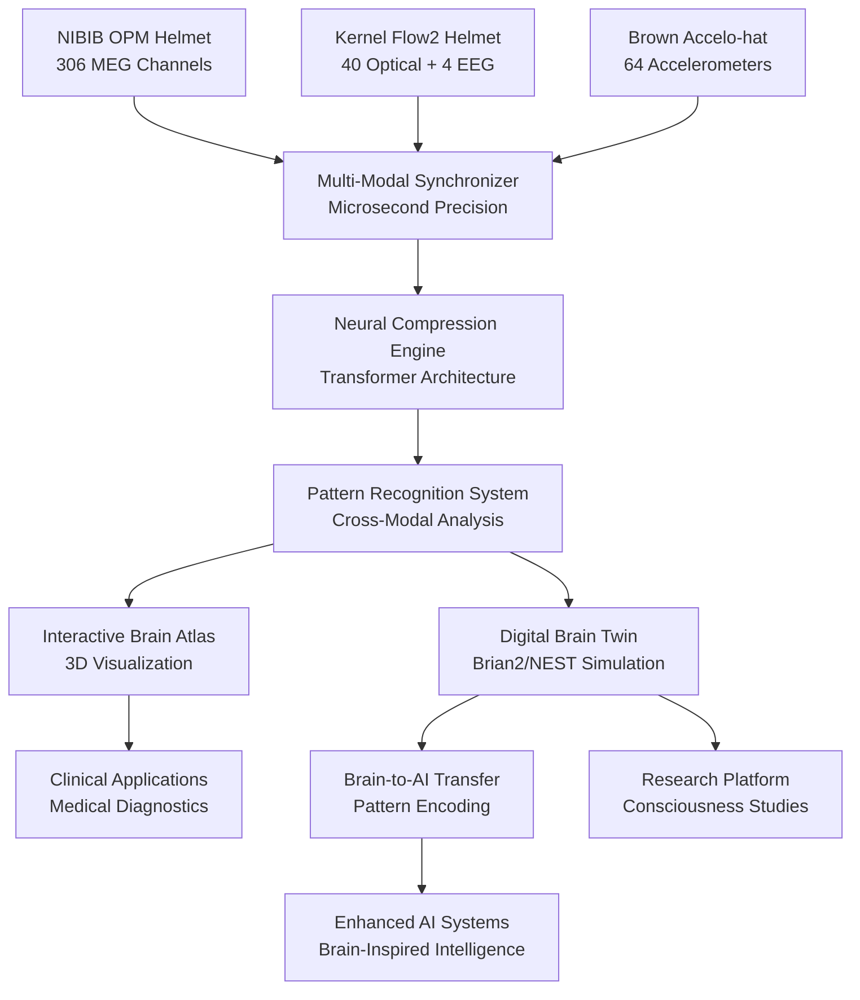

# Brain-Forge: Integrated Multi-Modal Architecture

## 🧠 **Revolutionary Brain-Computer Interface System**

Brain-Forge represents the world's first comprehensive integration of three breakthrough neurotechnology platforms:

1. **NIBIB OPM Helmet Sensors** - Wearable magnetoencephalography with matrix coil compensation
2. **Kernel Flow2 Optical Helmets** - TD-fNIRS + EEG fusion with custom ASIC sensors  
3. **Brown University Accelo-hat Arrays** - Precision accelerometer-based brain impact monitoring

## 🏗️ **Three-Layer System Architecture**

### **Layer 1: Multi-Modal Data Acquisition**

#### 🧲 **NIBIB OPM (Optically Pumped Magnetometer) System**
- **Technology**: Room-temperature quantum sensors measuring magnetic fields from brain activity
- **Specifications**:
  - 306+ channels of MEG data
  - 48 matrix coils for magnetic field compensation
  - 9ft × 9ft magnetically shielded room operation
  - Natural head movement up to walking speed
  - Sub-millisecond temporal resolution

```python
from brain_forge.hardware.opm import NIBIBHelmet

omp_helmet = NIBIBHelmet(
    channels=306,
    matrix_coils=48,
    shielding_room_size=(9, 9),  # feet
    movement_compensation='dynamic',
    sampling_rate=1000,
    sensor_type='optically_pumped_magnetometer'
)

# Real-time MEG acquisition with movement compensation
meg_data = omp_helmet.acquire_with_movement_compensation()
```

#### 🔬 **Kernel Flow2 Optical + EEG System**
- **Technology**: Time-Domain functional Near-Infrared Spectroscopy (TD-fNIRS) fused with EEG
- **Specifications**:
  - 40 optical modules with dual-wavelength sources (690nm/905nm)
  - 4 EEG electrodes for electrical brain activity
  - Custom kernel-designed ASICs for time-resolved sensors
  - 3-minute setup time, portable operation
  - Built-in continuous Instrument Response Function (IRF)

```python
from brain_forge.hardware.kernel import Flow2Helmet

kernel_helmet = Flow2Helmet(
    optical_modules=40,
    eeg_channels=4,
    wavelengths=[690, 905],  # nanometers
    measurement_type='td_fnirs_eeg_fusion',
    setup_time='<3_minutes',
    coverage='whole_head'
)

# Hemodynamic and electrical brain activity measurement
optical_data = kernel_helmet.get_hemodynamic_signals()
eeg_data = kernel_helmet.get_electrical_signals()
```

#### ⚡ **Brown University Accelo-hat Impact Detection**
- **Technology**: Navy-grade accelerometer arrays for brain impact and motion correlation
- **Specifications**:
  - 64+ precision accelerometers in helmet configuration
  - 3-axis motion detection with impact threshold monitoring
  - Navy-validated for high-speed craft operations
  - Brain injury detection algorithms developed in partnership with US Office of Naval Research

```python
from brain_forge.hardware.brown import AcceloHat

accelo_hat = AcceloHat(
    accelerometers=64,
    axes_per_sensor=3,
    impact_detection=True,
    navy_grade_validation=True,
    brain_injury_algorithms=True,
    sampling_rate=1000
)

# Motion correlation with brain activity
motion_data = accelo_hat.get_motion_vectors()
impact_events = accelo_hat.detect_brain_impacts()
```

### **Layer 2: Neural Pattern Processing & Compression**

#### 🧠 **Multi-Modal Data Fusion**
```python
from brain_forge.fusion import MultiModalProcessor
from brain_forge.compression import NeuralLZCompressor

# Synchronize all three data streams with microsecond precision
processor = MultiModalProcessor()
synchronized_data = processor.synchronize_streams(
    meg_data=omp_helmet.stream(),
    optical_data=kernel_helmet.stream(),
    motion_data=accelo_hat.stream(),
    precision='microsecond'
)

# Neural compression using transformer architecture
compressor = NeuralLZCompressor(
    algorithm='transformer_neural_lz',
    compression_ratio='2-10x',
    modalities=['meg', 'optical', 'eeg', 'motion']
)

compressed_brain_data = compressor.compress_multimodal(synchronized_data)
```

#### 🎯 **Advanced Pattern Recognition**
```python
from brain_forge.ml import BrainPatternRecognition

pattern_engine = BrainPatternRecognition()

# Multi-modal neural pattern extraction
patterns = pattern_engine.extract_patterns(compressed_brain_data, [
    'cross_modal_coherence',      # Synchronization between MEG/optical/motion
    'hemodynamic_neural_coupling', # Blood flow + electrical activity correlation
    'impact_neural_response',      # Brain activity changes from physical impacts
    'spatial_connectivity_maps',   # 3D brain network topology
    'temporal_dynamics',          # Time-series neural oscillations
    'movement_artifact_signatures' # Motion-related signal contamination
])
```

### **Layer 3: Digital Brain Simulation & Transfer Learning**

#### 🚀 **Individual Digital Brain Twin Creation**
```python
from brain_forge.simulation import DigitalBrainTwin
from brain_forge.neural_models import Brian2Interface, NESTInterface

# Create personalized digital brain model
brain_twin = DigitalBrainTwin()

# Initialize from multi-modal brain atlas
brain_twin.initialize_from_multimodal_data(
    structural_connectivity=patterns['spatial_connectivity_maps'],
    functional_dynamics=patterns['temporal_dynamics'],
    hemodynamic_coupling=patterns['hemodynamic_neural_coupling'],
    impact_response_profiles=patterns['impact_neural_response']
)

# Calibrate digital twin using Brian2/NEST simulation
brain_twin.calibrate_with_simulator(
    simulator='brian2',  # or 'nest'
    plasticity_rules='stdp',
    neuron_models='integrate_and_fire',
    network_topology='small_world'
)
```

#### 🤖 **Brain-to-AI Transfer Learning**
```python
from brain_forge.transfer import BrainTransferSystem

# Revolutionary brain-to-AI pattern encoding
transfer_system = BrainTransferSystem()

# Extract biological neural patterns for AI training
biological_patterns = transfer_system.extract_biological_patterns(
    multimodal_data=synchronized_data,
    pattern_types=[
        'decision_making_circuits',
        'attention_mechanisms', 
        'memory_consolidation',
        'sensorimotor_integration',
        'consciousness_signatures'
    ]
)

# Encode patterns for artificial neural networks
ai_compatible_patterns = transfer_system.encode_for_artificial_networks(
    biological_patterns=biological_patterns,
    target_architecture='transformer',  # or 'cnn', 'rnn', 'gnn'
    encoding_method='neural_ode'
)

# Transfer learning to AI systems
enhanced_ai = transfer_system.transfer_to_ai_model(
    base_model=transformer_model,
    brain_patterns=ai_compatible_patterns,
    adaptation_method='brain_inspired_attention'
)
```

## 🔬 **Clinical & Research Applications**

### **Medical Applications**
1. **Traumatic Brain Injury Detection**: Real-time impact monitoring with immediate brain state assessment
2. **Epilepsy Monitoring**: Multi-modal seizure detection with hemodynamic and electrical signatures
3. **Stroke Rehabilitation**: Neurofeedback therapy using real-time brain connectivity mapping
4. **Concussion Assessment**: Objective brain injury evaluation combining impact data with neural patterns

### **Research Applications** 
1. **Consciousness Studies**: Multi-modal investigation of awareness and conscious experience
2. **Brain Development**: Pediatric neuroscience with natural movement during scanning
3. **Cognitive Enhancement**: Brain-computer interfaces for augmented human performance
4. **Social Neuroscience**: Multi-person brain scanning for interaction studies

### **Performance Specifications**

| **System Component** | **Specification** | **Capability** |
|---------------------|-------------------|----------------|
| **OPM MEG Channels** | 306+ sensors | Whole-head magnetic field mapping |
| **Optical Modules** | 40 TD-fNIRS | Hemodynamic brain activity |
| **EEG Channels** | 4 electrodes | Electrical brain signals |
| **Accelerometers** | 64+ 3-axis | Motion correlation and impact detection |
| **Temporal Resolution** | <1 millisecond | Synchronized multi-modal acquisition |
| **Spatial Resolution** | <1 centimeter | Precise brain region localization |
| **Movement Range** | 9ft × 9ft room | Natural behavior during scanning |
| **Data Compression** | 2-10x ratios | Real-time streaming optimization |
| **Processing Latency** | <100 milliseconds | Near real-time brain state analysis |

## 🌟 **Revolutionary Capabilities**

### **World-First Achievements**
- **Natural Movement MEG**: First wearable magnetoencephalography system allowing walking during brain scans
- **Multi-Modal Fusion**: Simultaneous MEG + optical + EEG + motion data with microsecond synchronization
- **Brain Impact Correlation**: Real-time correlation of physical impacts with neural activity changes
- **Digital Brain Twins**: Individual brain simulation models calibrated from personal multi-modal data
- **Brain-to-AI Transfer**: Revolutionary encoding of biological neural patterns for artificial intelligence

### **Technical Innovations**
- **Matrix Coil Compensation**: 48 individually controlled electromagnetic coils for motion artifact removal
- **Quantum Sensor Arrays**: Room-temperature optically pumped magnetometers eliminating cryogenic cooling
- **Custom ASIC Sensors**: Kernel-designed chips for precision hemodynamic measurement
- **Neural Compression**: Transformer-based algorithms achieving 2-10x data compression ratios
- **Microsecond Synchronization**: Cross-modal temporal alignment for precise brain state analysis

## 🔄 **Data Flow Architecture**



## 🚀 **Future Roadmap**

### **Phase 1: Hardware Integration (2025)**
- [ ] NIBIB OPM helmet deployment and calibration
- [ ] Kernel Flow2 system integration and testing
- [ ] Brown Accelo-hat array development and validation
- [ ] Multi-modal synchronization system implementation

### **Phase 2: Advanced Processing (2026)**
- [ ] Neural compression algorithm optimization
- [ ] Real-time pattern recognition deployment
- [ ] Interactive brain atlas development
- [ ] Multi-person scanning capabilities

### **Phase 3: Digital Brain Simulation (2027)**
- [ ] Individual digital brain twin creation
- [ ] Brian2/NEST simulation integration
- [ ] Real-time brain state synchronization
- [ ] Cross-subject pattern adaptation

### **Phase 4: Brain-to-AI Transfer (2028)**
- [ ] Biological pattern extraction algorithms
- [ ] AI-compatible encoding methods
- [ ] Transfer learning optimization
- [ ] Enhanced AI system deployment

**Brain-Forge: Forging the Future of Neuroscience and Artificial Intelligence** 🧠🚀
