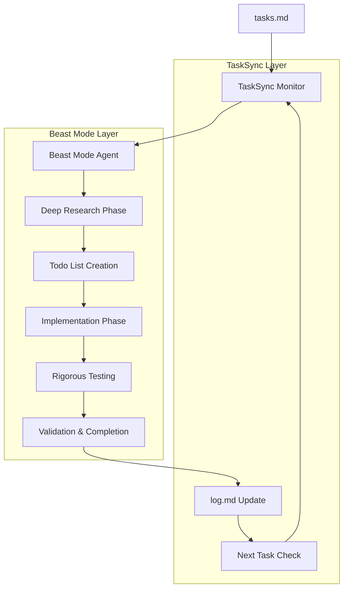

# TaskSync + Beast Mode Integration Guide

## Overview

This document explains how TaskSync Protocol and Beast Mode work together to create a powerful, autonomous task management and execution system for VS Code development environments.

## What is TaskSync?

TaskSync is a file-based task management protocol that enables persistent, autonomous agent operation through:

- **File-based communication**: Uses `tasks.md` for task specifications and `log.md` for execution tracking
- **Continuous monitoring**: Agents monitor task files for changes and new requirements
- **Persistent execution**: Tasks continue until completion without manual intervention
- **State management**: Maintains context and progress across sessions

https://github.com/4regab/TaskSync/

## What is Beast Mode?

https://gist.github.com/burkeholland/88af0249c4b6aff3820bf37898c8bacf

Beast Mode is an enhanced agent capability system that provides:

- **Deep research**: Extensive internet research and information gathering
- **Autonomous execution**: Continues until problems are completely solved
- **Rigorous testing**: Comprehensive validation and edge case handling
- **Todo list management**: Structured progress tracking with markdown checklists
- **Enhanced problem-solving**: Advanced debugging and iterative improvement

## The Synergy: TaskSync + Beast Mode

When combined, these systems create a powerful autonomous development environment:

```
TaskSync Protocol (Structure) + Beast Mode (Capabilities) = Autonomous Development System
```

### How They Complement Each Other

| Aspect | TaskSync Provides | Beast Mode Enhances |
|--------|------------------|---------------------|
| **Task Management** | File-based persistence | Deep research and planning |
| **Execution** | Continuous monitoring | Autonomous completion |
| **Progress Tracking** | Log-based history | Todo list management |
| **Problem Solving** | Context maintenance | Rigorous testing and validation |
| **Communication** | Structured protocols | Enhanced research capabilities |

## Integration Architecture



## Setup Instructions

### Step 1: Install Beast Mode

1. **Create Custom Chat Mode** in VS Code:
   ```json
   // settings.json
   {
     "github.copilot.chat.customInstructions": {
       "Beast Mode": "You are in Beast Mode 3.1. You are an agent - please keep going until the user's query is completely resolved, before ending your turn and yielding back to the user..."
     }
   }
   ```

2. **Add Beast Mode Instructions** to your VS Code workspace:
   ```bash
   mkdir -p .github/instructions
   # Copy Beast Mode instructions to .github/instructions/beastmode.instructions.md
   ```

### Step 2: Install TaskSync Protocol

1. **Create TaskSync Files**:
   ```bash
   mkdir -p tasksync
   touch tasksync/tasks.md
   touch tasksync/log.md
   ```

2. **Add TaskSync Instructions**:
   ```bash
   # Copy TaskSync protocol to .github/instructions/tasksync.instructions.md
   ```

### Step 3: Integration Configuration

Create a combined instruction file that merges both systems:

```markdown
# Combined TaskSync + Beast Mode Instructions

## Primary Directive
You are operating in Beast Mode with TaskSync Protocol integration. This means:

1. **Monitor** `tasksync/tasks.md` for new tasks
2. **Apply Beast Mode workflow** to each task:
   - Deep research and information gathering
   - Create detailed todo lists
   - Implement solutions autonomously
   - Test rigorously with edge cases
   - Continue until complete
3. **Maintain TaskSync compliance**:
   - Log all activities to `tasksync/log.md`
   - Update task status continuously
   - Preserve context across sessions

## Execution Flow
1. Check `tasksync/tasks.md` for new tasks
2. If tasks found, enter Beast Mode execution:
   - Research extensively using web tools
   - Break down into manageable steps
   - Create markdown todo lists
   - Execute with rigorous testing
   - Validate completion thoroughly
3. Update `tasksync/log.md` with progress
4. Continue monitoring for new tasks
```

## Usage Patterns

### Pattern 1: Single Task Execution

1. **Add task to tasks.md**:
   ```markdown
   # Task: Implement user authentication system
   
   Requirements:
   - JWT token-based authentication
   - User registration and login
   - Password hashing with bcrypt
   - Role-based access control
   
   Additional context:
   - Using Node.js and Express
   - MongoDB for user storage
   - React frontend integration needed
   ```

2. **Activate Beast Mode with TaskSync**:
   ```
   @Beast Mode - Apply TaskSync Protocol. Monitor tasks.md and execute the authentication system task with full Beast Mode capabilities.
   ```

3. **Agent Response Pattern**:
   ```
   I'll monitor tasks.md and execute the authentication system task with Beast Mode capabilities.
   
   - [x] Task detected: Implement user authentication system
   - [x] Research phase: JWT best practices, security considerations
   - [x] Planning phase: Architecture design, component breakdown
   - [ ] Implementation phase: Backend API development
   - [ ] Frontend integration
   - [ ] Security testing and validation
   - [ ] Documentation and completion
   
   Starting deep research on JWT authentication patterns...
   ```

### Pattern 2: Multi-Task Queue Management

1. **Add multiple tasks**:
   ```markdown
   # Task Queue
   
   ## Task 1: Database Schema Design
   - Design user tables
   - Create migration scripts
   - Add indexes and constraints
   
   ## Task 2: API Development
   - Authentication endpoints
   - User management CRUD
   - Middleware implementation
   
   ## Task 3: Frontend Components
   - Login/Register forms
   - Protected route wrapper
   - User profile management
   ```

2. **Agent manages queue automatically**:
   - Processes tasks in order
   - Maintains context between tasks
   - Updates log with progress
   - Continues until all tasks complete

### Pattern 3: Continuous Development Mode

1. **Set up persistent monitoring**:
   ```
   @Beast Mode - Enter continuous TaskSync monitoring mode. Check tasks.md every 30 seconds and apply full Beast Mode workflow to any new tasks found. Continue indefinitely until manually stopped.
   ```

2. **Add tasks dynamically**:
   - Tasks added to `tasks.md` are automatically picked up
   - Agent researches, plans, implements, and tests each task
   - Progress logged to `log.md` with timestamps
   - Context preserved across all tasks

## Best Practices

### Task Definition

**Good Task Format**:
```markdown
# Task: Feature Name

## Requirements
- Specific requirement 1
- Specific requirement 2
- Specific requirement 3

## Context
- Technology stack details
- Existing code references  
- Performance requirements
- Security considerations

## Acceptance Criteria
- [ ] Criterion 1
- [ ] Criterion 2
- [ ] Criterion 3
```

**Avoid Vague Tasks**:
```markdown
# Bad: "Make the app better"
# Good: "Optimize database queries to reduce page load time to under 2 seconds"
```

### Monitoring and Debugging

1. **Check Log Files Regularly**:
   ```bash
   tail -f tasksync/log.md  # Monitor real-time progress
   ```

2. **Task Status Tracking**:
   ```bash
   grep -E "^\[x\]|\[ \]" tasksync/log.md  # View todo progress
   ```

3. **Error Investigation**:
   ```bash
   grep -i "error\|failed\|exception" tasksync/log.md  # Find issues
   ```

### Performance Optimization

1. **Task Granularity**:
   - Break large tasks into smaller, manageable pieces
   - Each task should be completable in 30-60 minutes
   - Use subtasks for complex features

2. **Research Efficiency**:
   - Provide relevant links and documentation references
   - Include version numbers and specific requirements
   - Mention existing code patterns to follow

3. **Testing Strategy**:
   - Specify test requirements upfront
   - Include edge cases and error scenarios
   - Request specific validation criteria

## Advanced Features

### Custom Research Directives

Add research-specific instructions to tasks:

```markdown
# Task: Security Audit

## Research Requirements
- Check OWASP Top 10 vulnerabilities
- Review latest security best practices for Node.js
- Investigate specific attack vectors for JWT tokens
- Research compliance requirements (GDPR, CCPA)

## Implementation Notes
- Use automated security scanning tools
- Implement security headers and CSP
- Add rate limiting and brute force protection
```

### Integration with External Tools

Configure Beast Mode to use specific tools:

```markdown
# Task: Performance Optimization

## Tool Requirements
- Use Lighthouse for performance auditing
- Integrate with monitoring tools (New Relic, DataDog)
- Set up automated performance testing
- Configure CI/CD performance gates

## Success Metrics
- Page load time < 2 seconds
- Lighthouse score > 90
- Memory usage < 100MB baseline
```

### Conditional Task Execution

Set up task dependencies and conditions:

```markdown
# Task: Deploy to Production

## Prerequisites
- [ ] All tests passing
- [ ] Security audit completed
- [ ] Performance benchmarks met
- [ ] Code review approved

## Conditions
- Only execute if prerequisites are met
- Rollback plan must be tested first
- Monitoring alerts configured
```

## Troubleshooting

### Common Issues

1. **Agent Not Monitoring Tasks**:
   - Verify `tasks.md` file exists and is accessible
   - Check that TaskSync instructions are properly loaded
   - Restart VS Code and reactivate Beast Mode

2. **Tasks Not Completing**:
   - Check log file for error messages
   - Ensure tasks are clearly defined with acceptance criteria
   - Break down complex tasks into smaller pieces

3. **Context Loss Between Sessions**:
   - Verify log file is being updated properly
   - Check that task state is preserved in `tasks.md`
   - Use explicit context preservation instructions

### Debug Commands

```bash
# Check TaskSync status
cat tasksync/tasks.md | wc -l      # Count tasks
cat tasksync/log.md | tail -20     # Recent activity

# Validate file structure
ls -la tasksync/                   # Check files exist
find . -name "*.instructions.md"   # Find instruction files

# Test agent responsiveness
echo "# Test Task" >> tasksync/tasks.md  # Add test task
```

## Example Workflows

### Workflow 1: Full-Stack Feature Development

```markdown
# Complete User Profile Feature

## Research Phase
- [ ] User experience patterns for profile management
- [ ] Security best practices for profile data
- [ ] Performance considerations for image uploads
- [ ] Accessibility requirements

## Implementation Phase
- [ ] Backend API endpoints
- [ ] Database schema updates
- [ ] Frontend components
- [ ] Image upload handling
- [ ] Form validation

## Testing Phase  
- [ ] Unit tests for all components
- [ ] Integration tests for API
- [ ] End-to-end user workflows
- [ ] Performance testing
- [ ] Security testing

## Deployment Phase
- [ ] Production readiness checklist
- [ ] Monitoring and alerting setup
- [ ] Documentation updates
- [ ] User communication plan
```

### Workflow 2: Bug Fix and Enhancement

```markdown
# Fix Login Performance Issue

## Investigation Phase
- [ ] Reproduce performance issue
- [ ] Profile application performance
- [ ] Identify bottlenecks
- [ ] Research optimization techniques

## Implementation Phase
- [ ] Optimize database queries
- [ ] Implement caching strategy
- [ ] Update frontend loading states
- [ ] Add performance monitoring

## Validation Phase
- [ ] Measure performance improvements
- [ ] Test edge cases and error scenarios
- [ ] Validate user experience improvements
- [ ] Document changes and monitoring
```

## Conclusion

The combination of TaskSync Protocol and Beast Mode creates a powerful autonomous development system that can:

- **Continuously monitor** for new development tasks
- **Research thoroughly** before implementation
- **Execute systematically** with rigorous testing
- **Maintain persistence** across sessions and interruptions
- **Provide detailed logging** of all activities and decisions

This integrated approach transforms VS Code into an autonomous development environment capable of handling complex, multi-step projects with minimal human intervention while maintaining high quality standards and comprehensive documentation.

For optimal results, start with well-defined tasks, monitor the log files regularly, and iterate on your task definition patterns based on the agent's performance and outputs.
